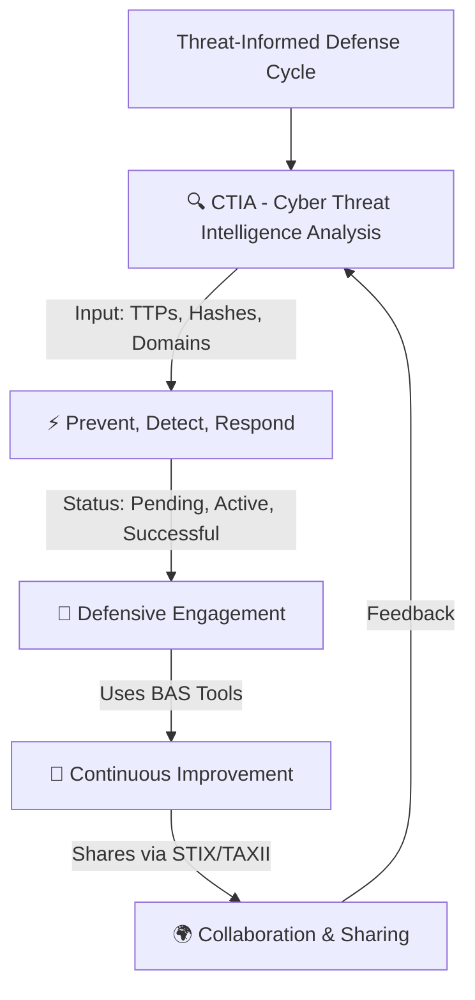
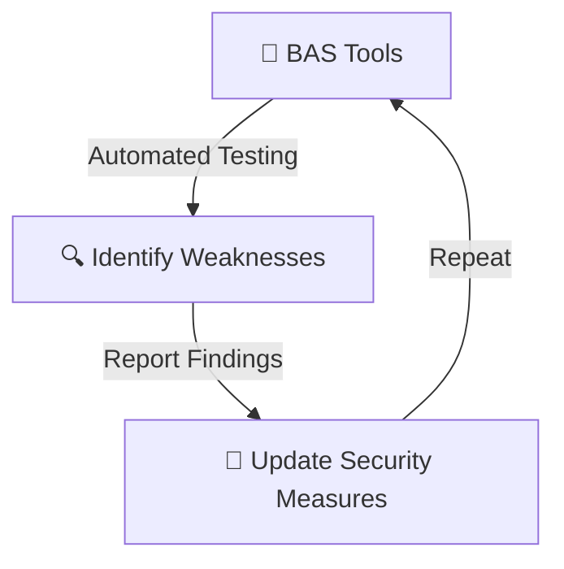

# 🛡️ Foundations of Operationalizing MITRE ATT&CK v13 - Introduction  

Welcome to the foundational guide on operationalizing **MITRE ATT&CK v13**! 🎯  

This document walks you through **Threat-Informed Defense**, using key elements like:  
✅ **Cyber Threat Intelligence Analysis (CTIA)**  
✅ **Defensive Engagement Process**  
✅ **Collaboration and Sharing**  

📌 **The Goal?** Improve how organizations **Prevent**, **Detect**, and **Respond** to cyber threats by leveraging **real-world attack data, Breach and Attack Simulation (BAS) tools, and industry collaboration.**  

---

## 📌 **Threat-Informed Defense Process**  



---

## 🛠 **Step 1: Cyber Threat Intelligence Analysis (CTIA)**  

🎯 **Purpose:** Analyzes attack tactics, malware hashes, and suspicious domains to predict cyber threats.  

### **📝 Inputs & Outputs**  
| **Inputs**                           | **CTIA Processing**        | **Outputs**                               |
|--------------------------------------|---------------------------|-------------------------------------------|
| 🔹 **Tactics, Techniques, Procedures (TTPs)**  | 🔍 Threat Pattern Analysis | 🚫 Prevent: Pending / Active / Successful |
| 🔹 **Malware Hashes**               | 🔄 Identify Behaviors      | 🛑 Detect: Pending / Active / Successful |
| 🔹 **Suspicious Domains**           | ⚡ Threat Intelligence Correlation | ⚡ Respond: Pending / Active / Successful |

📌 **Real-World Example:** If a security team identifies a **new malware variant**, they analyze its behavior (hash, network communication) to **predict and block future attacks**.  

---

## 🔥 **Step 2: Defensive Engagement Process**  

🎯 **Purpose:** Uses **Breach and Attack Simulation (BAS)** tools to test security defenses against real attack scenarios.  

📌 **How It Works:**  
- The **BAS tool** uses behaviors identified in **CTIA** to simulate attacks in an organization's environment.  
- Results show whether the **Prevent, Detect, and Respond** actions worked effectively.  
- If issues are found, updates are made, and the process repeats.  



📌 **Real-World Example:** A **financial organization** simulates a **ransomware attack** to test whether **its endpoint security can detect and stop it in time**.  

🎥 **BAS Tools in Action!**  
  

---

## 🔄 **Step 3: Continuous Improvement (Collaboration & Sharing)**  

🎯 **Purpose:** Shares real-world cyber threat data with global organizations using standard formats like **STIX** and **TAXII**.  

### **🔗 Key Collaboration Platforms & Resources**
| **Platform**                                      | **Purpose** |
|--------------------------------------------------|-------------|
| 🌐 [**CVE (Common Vulnerabilities and Exposures)**](https://www.cve.org/) | Database of known security vulnerabilities |
| 🔬 [**CRITS (Collaborative Research Into Threats)**](https://crits.github.io/) | Open-source tool for sharing cyber threat intelligence |
| 🎯 [**MITRE ATT&CK**](https://attack.mitre.org/) | Global framework for tracking adversary tactics & techniques |
| 🏛️ [**MITRE CTID - Center for Threat-Informed Defense**](https://ctid.mitre.org/projects/) | Research initiative for improving cyber defense |
| 🛡️ [**MITRE ATT&CK Evaluations**](https://attackevals.mitre-engenuity.org/) | Independent testing of security vendors |
| 🔐 [**ACS Center (Advanced Cybersecurity)**](https://www.acscenter.org/) | Focuses on security research & response |
| 🛠️ [**Gartner's BAS Tools Review**](https://www.gartner.com/reviews/market/breach-and-attack-simulation-bas-tools) | Reviews the best Breach & Attack Simulation tools |

📌 **Real-World Example:**  
A **government cybersecurity agency** shares **indicators of compromise (IOCs) of a new nation-state attack** with banks and hospitals via **TAXII feeds**, ensuring fast response times.  

🚀 **Sharing Knowledge in Action!**  
  

---

## 🔐 **Final Thoughts**  

🚀 **Operationalizing MITRE ATT&CK v13** is not just about knowing attacker techniques; it’s about **applying** them to strengthen cybersecurity.  

✅ **Analyze threats** using CTIA.  
✅ **Test security defenses** with BAS simulations.  
✅ **Share intelligence** for a global cyber defense strategy.  

📌 **With continuous collaboration and real-time threat sharing, the cybersecurity community stays one step ahead of adversaries.** 🌍💪  

---

## 🔗 **Further Reading & Exploration**  
- 🏛️ [MITRE ATT&CK Framework](https://attack.mitre.org/)  
- 🔍 [MITRE ATT&CK Evaluations](https://attackevals.mitre-engenuity.org/)  
- 🔐 [MITRE CTID - Center for Threat-Informed Defense](https://ctid.mitre.org/projects/)  
- 🛡️ [BAS Tools Review - Gartner](https://www.gartner.com/reviews/market/breach-and-attack-simulation-bas-tools)  
  
```


