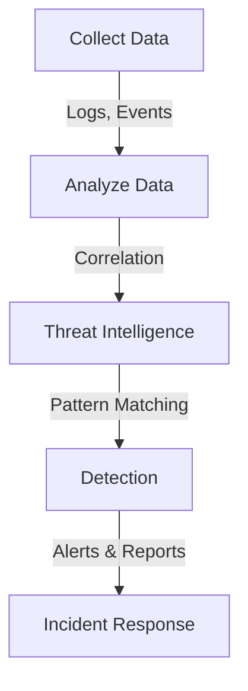
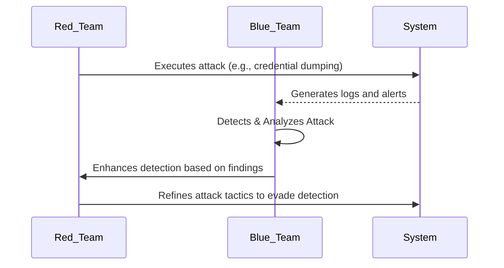
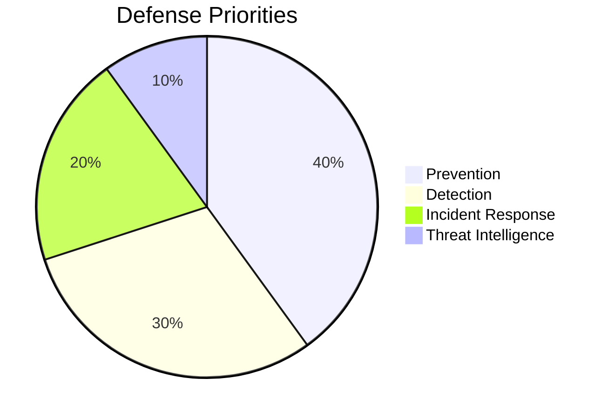
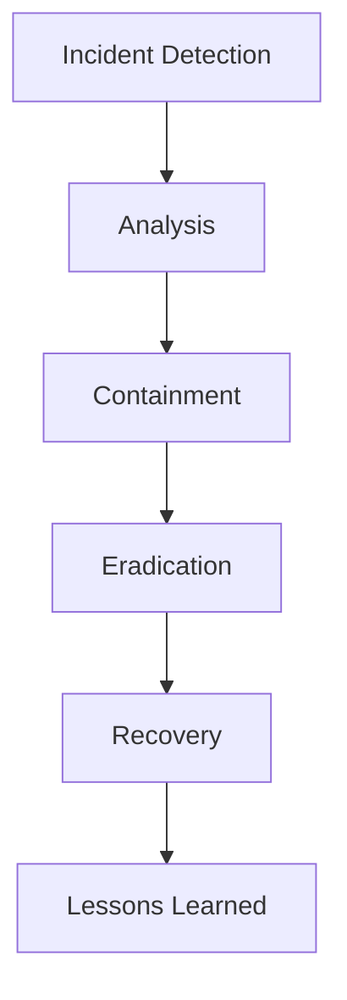

# 🚀 Operationalizing ATT&CK

**MITRE ATT&CK is a framework that helps organizations understand, detect, and mitigate cyber threats effectively. This guide explains how to operationalize ATT&CK with practical methods, tools, and best practices.** 🔥

---

## 📜 Table of Contents
1. [🔍 Detection and Analytics](#detection-and-analytics)
2. [🎭 Adversary Emulation and Red Teaming](#adversary-emulation-and-red-teaming)
3. [🛡️ Defenses and Mitigations](#defenses-and-mitigations)

---

## 🔍 Detection and Analytics

**Understanding threats is the first step to defending against them!**  
Detection and analytics help security teams recognize malicious activities and respond effectively.

### 📊 Data Collection Sources
| 🔍 **Source** | 🛠️ **Tools** |
|--------------|--------------|
| **Process Monitoring** | Sysmon, EDR, Windows Event Logs |
| **File & Registry Monitoring** | Sysmon, Windows Logs, EDR |
| **Authentication Logs** | Domain Controller Logs |
| **Packet Capture (Network Traffic)** | IDS, Zeek, Suricata |

### 📌 **How Detection Works**

### 🔥 **MITRE Cyber Analytics Repository (CAR)**
A collection of analytics that maps to **ATT&CK techniques**. It includes:
- Hypotheses 🎯
- ATT&CK references 🔗
- Sample pseudocode 📝
- Unit tests 🛠️

---

## 🎭 Adversary Emulation and Red Teaming

**“Think like an attacker to strengthen defenses!”** 🕵️‍♂️  

### 🛡️ **Red Team vs Blue Team vs Purple Team**
| **Team** | **Role** |
|---------|---------|
| 🔴 **Red Team** | Simulates real-world attacks |
| 🔵 **Blue Team** | Defends the network and responds to attacks |
| 🟣 **Purple Team** | Collaboration between Red & Blue teams for continuous improvement |

### 🔄 **How Red Teaming Works**

### 🛠️ **Red Teaming Tools**
- 🏴 **Atomic Red Team** (Open-source adversary emulation)
- 🏴 **CALDERA** (MITRE’s automated red teaming tool)
- 🏴 **AttackIQ** (Commercial BAS tool)

---

## 🛡️ Defenses and Mitigations

**"Attackers evolve, so should defenses!"** 🛡️  

### 🚀 **Key Defensive Strategies**

### 🔄 **Incident Response Lifecycle**

### 🔥 **MITRE ATT&CK Framework in Action**
| 🔍 **Tactic** | 🎯 **Purpose** | ⚔️ **Examples** |
|--------------|---------------|----------------|
| 🔎 **Discovery** | Gain knowledge about the system & network | System Info Discovery (T1082) |
| 📡 **Lateral Movement** | Move between systems | Remote Desktop Protocol (T1021.001) |
| 🏴 **Exfiltration** | Steal sensitive data | Automated Exfiltration (T1020) |
| 💣 **Impact** | Disrupt system operations | Data Encryption for Impact (T1486) |

---

## 🎯 Conclusion
Operationalizing ATT&CK helps security teams **detect, analyze, and defend** against threats effectively. By combining **detection, adversary emulation, and defense strategies**, organizations can **stay ahead of attackers**. 🚀

---
### 📌 **References**
- 🔗 [MITRE ATT&CK Official Website](https://attack.mitre.org/)
- 🔗 [MITRE Cyber Analytics Repository (CAR)](https://car.mitre.org/)
- 🔗 [Atomic Red Team GitHub](https://github.com/redcanaryco/atomic-red-team)
