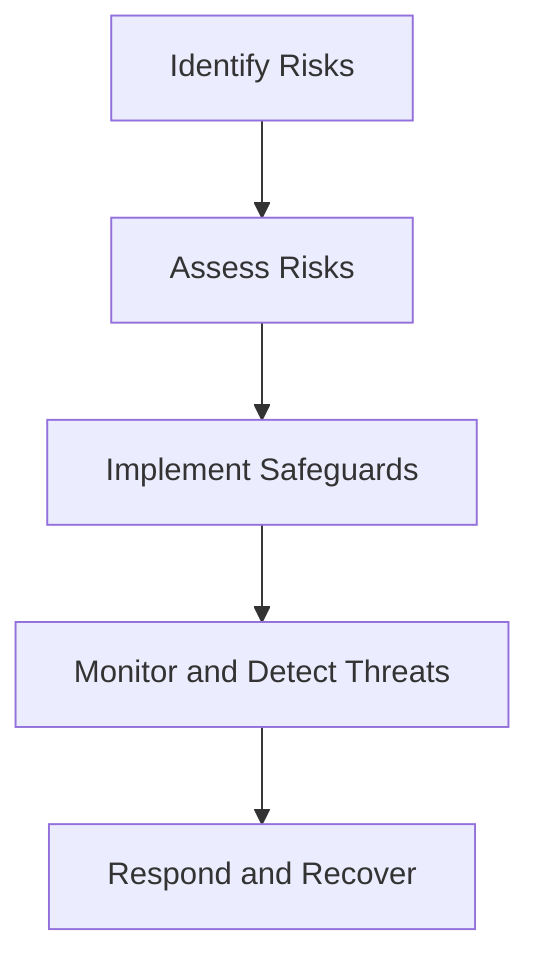
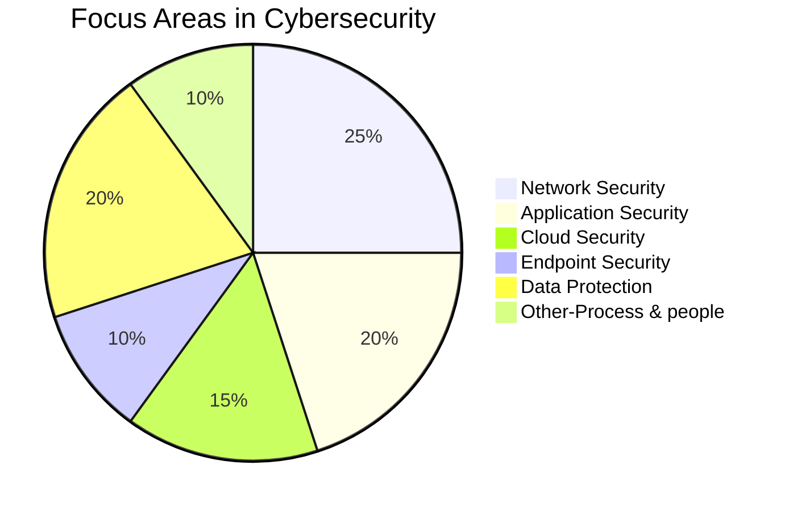

# Introduction to Cybersecurity 🚀

Cybersecurity is essential in our modern world, where we store and transmit sensitive information digitally. It involves protecting systems, networks, and data from unauthorized access, attacks, and damage.

---

## What is Cybersecurity? 🔐

Cybersecurity refers to the practice of defending **computers**, **servers**, **mobile devices**, **networks**, and **data** from malicious attacks, unauthorized access, or destruction. It involves implementing various technologies, processes, and practices to safeguard digital assets and information.

### Key Aspects of Cybersecurity:
- **Confidentiality**: Ensuring that information is accessible only to those who have the right to access it.
- **Integrity**: Ensuring that the information is accurate, complete, and trustworthy.
- **Availability**: Ensuring that authorized users can access information when needed.

---

## Principles of Information Security 🔒

The **CIA** triad is the foundation of information security principles:

| **Principle**      | **Description**                                                                 |
|--------------------|---------------------------------------------------------------------------------|
| **Confidentiality** | Ensuring that data is only accessible to authorized users.                      |
| **Integrity**       | Ensuring the accuracy and consistency of data over its lifecycle.               |
| **Availability**    | Ensuring that information and resources are accessible when required.           |

---

### AAA in Cybersecurity 🔐

The **AAA** model defines three important principles:

- **Authentication**: Verifying the identity of users or systems.
- **Authorization**: Determining what actions or resources a user can access after authentication.
- **Accounting**: Tracking and logging user activities to ensure compliance and security.

---

### DAD Model in Cybersecurity ⚠️

The **DAD** model represents the stages of security breaches:

- **Disclosure**: Unauthorized access to data.
- **Alteration**: Unauthorized modification of data.
- **Destruction**: Unauthorized deletion of data.

---

## Flowchart: The Cybersecurity Process 🌐

Here’s a simple flowchart showing the general **Cybersecurity Process**:

This process is crucial for understanding the stages of implementing cybersecurity measures in an organization.

---

## Pie Chart: Distribution of Cybersecurity Focus 🎯

This pie chart shows the **typical distribution** of focus areas in cybersecurity:

Data for this pie chart is based on various industry reports and surveys. For example, the **2023 Cybersecurity Report** from **Cybersecurity Ventures** suggests that a large portion of resources is dedicated to **network security**, with growing attention on **cloud security** and **endpoint security**.

> Source: [Cybersecurity Ventures 2023 Cybersecurity Report](https://cybersecurityventures.com)

---

## Summary 📝

In cybersecurity, **protecting data** and systems is critical. By understanding the core principles of information security, such as **CIA**, **AAA**, and **DAD**, and implementing solid **cybersecurity practices**, we can secure systems against a wide range of threats. With technologies and processes in place, organizations can ensure data confidentiality, integrity, and availability.
