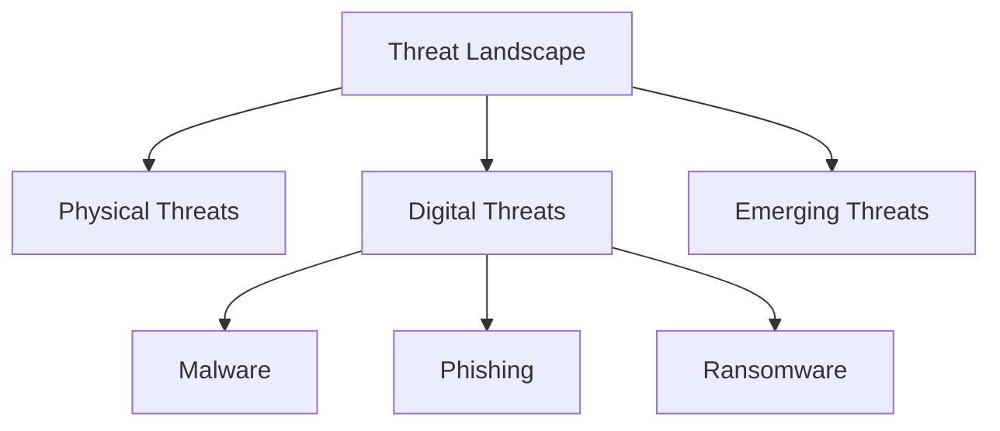
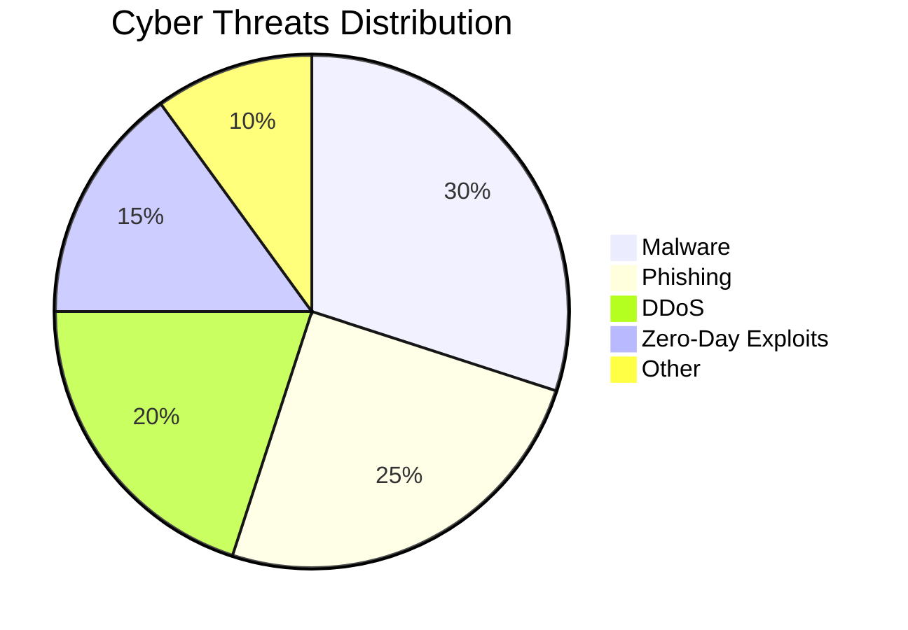
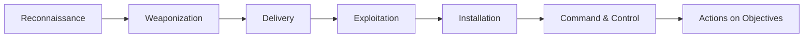

# 📌 Module 2: The Threat Landscape

## 📖 Table of Contents
1. [Introduction](#introduction)
2. [Threat Landscape Overview](#threat-landscape-overview)
3. [Threat Actors](#threat-actors)
4. [Cybersecurity Threats](#cybersecurity-threats)
5. [Threat Intelligence](#threat-intelligence)
6. [Attack Frameworks](#attack-frameworks)
7. [The Threat Landscape](#the-threat-landscape)
8. [Final Quiz Questions & Answers](#final-quiz-questions--answers)

---

## 🔎 Introduction
Understanding the **threat landscape** is crucial for cybersecurity. This module explores **physical and digital threats**, common **attack vectors**, different types of **threat actors**, and **threat intelligence services** that help prevent cyberattacks.

---

## 🌍 Threat Landscape Overview
The **threat landscape** consists of all **potential threats** to cybersecurity, both **physical and digital**. This includes:

- **Physical Threats** (e.g., unauthorized access to data centers)
- **Digital Threats** (e.g., malware, phishing, ransomware)
- **Emerging Threats** (e.g., AI-driven attacks, deepfakes, IoT vulnerabilities)

### 🔄 Threat Landscape Flowchart

---

## 🎭 Threat Actors
Threat actors are individuals or groups responsible for cyberattacks. They vary based on **motivation and intent**:

| Threat Actor | Motivation |
|-------------|-----------|
| **Cybercriminal** | Financial gain 💰 |
| **Hacktivist** | Social/political activism ✊ |
| **Cyberterrorist** | Fear and disruption 🔥 |
| **Cyberwarrior** | Government-backed attacks 🏛️ |
| **Insider Threat** | Revenge or espionage 🕵️ |

---

## ⚠️ Cybersecurity Threats
### 🔥 Common Cyber Threats
1. **Malware** - Viruses, worms, trojans, ransomware 🦠
2. **Phishing** - Deceptive emails stealing data 📩
3. **DDoS Attacks** - Overloading servers 💥
4. **Zero-Day Exploits** - Exploiting unknown vulnerabilities 🚨

### 📊 Cyber Threats Pie Chart (Data from [Verizon DBIR Report](https://www.verizon.com/business/resources/reports/dbir/))

---

## 🕵️ Threat Intelligence
Threat Intelligence helps organizations **understand, predict, and prevent** cyber threats.

### 🔹 Types of Threat Intelligence
| Type | Description |
|------|-------------|
| **Strategic** | High-level insights for executives 📊 |
| **Tactical** | TTPs (Tactics, Techniques, and Procedures) of attackers 🛡️ |
| **Operational** | Real-time threat data 🚀 |
| **Technical** | Indicators of Compromise (IoCs) 🔍 |

### 🛠️ Common Frameworks Used
1. **MITRE ATT&CK** - Common taxonomy for cyberattacks 🔗
2. **Cyber Kill Chain** - Stages of a cyberattack 📉
3. **STIX/TAXII** - Standardized threat intel sharing 📡

---

## 🎯 Attack Frameworks
### 🔄 Cyber Kill Chain (Stages of an Attack)

### 💡 MITRE ATT&CK vs Cyber Kill Chain
| Feature | MITRE ATT&CK | Cyber Kill Chain |
|---------|--------------|----------------|
| **Focus** | TTPs (Techniques, Tactics, Procedures) | Attack stages |
| **Details** | More in-depth 📚 | Simpler 📑 |
| **Use Case** | Advanced Threat Detection | Basic Attack Analysis |

---

## 🌐 The Threat Landscape
- Organizations must **stay ahead** of cyber threats.
- Implement **multi-layered security defenses** 🔐.
- Use **threat intelligence** to anticipate attacks 🚀.

---

## 📋 Final Quiz Questions & Answers

### 1️⃣ Which standard develops a common language for cyberthreat information?
✅ **Structured Threat Information Expression (STIX)**

### 2️⃣ Which two attack vector categories characterize a ransomware attack?
✅ **Pre-exploit & Human**

### 3️⃣ What are two key ingredients of a successful social engineering attack?
✅ **Gaining the trust of the victim & Compelling the victim to act**

### 4️⃣ Which definition best represents the Cyber Kill Chain?
✅ **Describes the stages of a cyber attack**

### 5️⃣ Which hacker type is someone employed by a cybersecurity firm for penetration testing?
✅ **Blue hat**

### 6️⃣ What is a benefit of using MITRE ATT&CK?
✅ **Provides a common taxonomy for understanding and mitigating cyberattacks**

### 7️⃣ Which expression best qualifies as threat intelligence?
✅ **Security implications and actionable advice**

### 8️⃣ Which system assigns a severity score to cyberthreats?
✅ **Common Vulnerability Scoring System (CVSS)**

---

**📌 Summary:**
- Cyber threats evolve rapidly; **continuous monitoring** is necessary.
- **Threat actors** vary in intent; organizations must recognize them.
- **Threat intelligence** helps prevent and respond to attacks.
- **Frameworks** like MITRE ATT&CK and Cyber Kill Chain aid in analysis.
