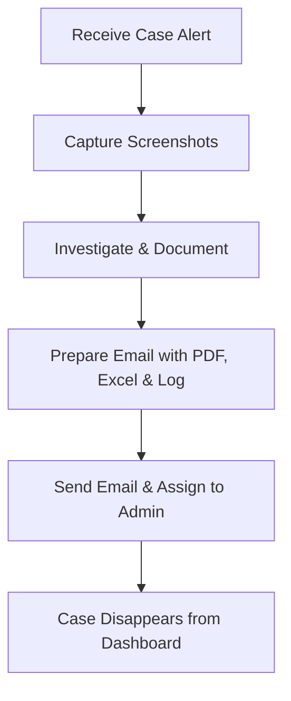

# 🔍 Google Chronicle Training Summary – Feb 13, 2025 - Mojii

This document is my quick-reference guide for everything we covered in our Google Chronicle training session. I’ve split it into two main sections: **🚀 Processos** (the step-by-step processes we need to do) and **🔑 Key Points** (the important bits we have to remember). I’ve also added some cool visuals, tables, flow charts, and GIFs to make it fun and easy to follow. Enjoy! 🎉

---

## 📑 Table of Contents

| Section | Topics |
|---------|--------|
| [🚀 Processos](#processos) | 1. UI Navigation & Time Management 🕵️‍♂️ <br> 2. Case Handling Process 📂 <br> 3. EDR & Incident Analysis Process 🔎 <br> 4. Log Analysis Process 📊 <br> 5. Vulnerability Search Process 🔍 <br> 6. Rule Dashboard Monitoring Process 📈 <br> 7. IOC Dashboard Process 🛡️ <br> 8. Additional Security Tool Monitoring Process 🏗️ |
| [🔑 Key Points](#key-points) | 1. Google Chronicle Architecture & Comparison 🏛️ <br> 2. UI & Data Presentation 🎨 <br> 3. Log Structure Details 🗄️ <br> 4. Search Attributes & UDM Fields 🔢 <br> 5. Rules Overview 📏 <br> 6. Dashboard Tools & Their Uses 🖥️ <br> 7. Client Network & Security Environment 🌐 <br> 8. Additional Security Features 🛠️ |

---

## 🚀 Processos

### 1️⃣ UI Navigation & Time Management 🕵️‍♂️
The UI in Google Chronicle is designed by Google’s top-notch UI/UX experts. **Always scan the page from top-to-bottom** because the most important details are at the top. Also, check the time zone – if you’re in Sri Lanka, make sure you convert the timeline accordingly.

### 2️⃣ Case Handling Process 📂
Before assigning any case:
- ✅ **Take screenshots.**
- ✅ **Investigate thoroughly and document findings.**
- ✅ **Prepare an email with:**
  - 📄 PDF report
  - 📊 Excel sheet
  - 📝 Raw log file (TXT)

Once assigned, cases **disappear** from the dashboard.

#### 📜 Flowchart: Case Handling Process


### 3️⃣ EDR & Incident Analysis Process 🔎
- **Analyze tactics and techniques** behind an alert.
- **Filter out irrelevant nodes** (e.g., "shadow snapshot").
- **Focus on high-severity alerts.**

### 4️⃣ Log Analysis Process 📊
| Log Component | Description |
|--------------|------------|
| **Metadata** | Timestamp & product details 🕰️ |
| **Event** | Inbound/outbound, IP addresses 🌍 |
| **Outcome** | Severity level (High/Medium/Low) ⚠️ |
| **Condition** | Event trigger details 🔑 |
| **Patch** | Record of similar events 🔄 |

A single case file can display up to **30 sub-cases**. If exceeded, extra cases are grouped into a new file.

### 5️⃣ Vulnerability Search Process 🔍
Steps:
1. **Search by vulnerability name.**
2. View rules covering that vulnerability.
3. Identify **allowed traffic** (focus on unblocked threats!).
4. Apply filters (e.g., "show only commands").

### 6️⃣ Rule Dashboard Monitoring Process 📈
| Graph Type | Meaning |
|-----------|--------|
| 📊 **Flat Graph** | Rule is triggering consistently (normal pattern) |
| 📈 **Changing Graph** | Possible anomalies (needs investigation) |

### 7️⃣ IOC Dashboard Process 🛡️
The **IOC Dashboard** filters out **compromised items** from threat intel. It's a goldmine for finding cases needing further analysis.

> 
> *GIF: Phishing alerts caught in real-time.*

### 8️⃣ Additional Security Tool Monitoring Process 🏗️
- **IZO** 🕵️‍♂️ – Monitors social media brand misuse.
- **FortiReason** 🔒 – Detects and blocks data leaks.
- **Port Protection** 🌐 – Ensures network port security.

> 
> *GIF: Secure those ports!*

---

## 🔑 Key Points

### 1️⃣ Google Chronicle Architecture & Comparison 🏛️
| Feature | Google Chronicle | Traditional SIEM |
|---------|----------------|----------------|
| **Deployment** | Cloud-based ☁️ | On-premise 🏢 |
| **Storage** | Scalable 🔄 | Limited 💾 |
| **Speed** | Real-time ⚡ | Slower 🐌 |

### 2️⃣ UI & Data Presentation 🎨
- **Most critical info** is always at the top.
- **Set local time** in the UI.

### 3️⃣ Log Structure Details 🗄️
- **5 Log Parts:** Metadata, Event, Outcome, Condition, Patch.
- **Max sub-cases per file:** **30**.

### 4️⃣ Search Attributes & UDM Fields 🔢
- **Search using:** `target user` & `principal user`.
- **UDM Fields** allow advanced filtering.

### 5️⃣ Rules Overview 📏
- **Queue-Related Rules:** Developed by Google, ~75%+ accuracy.
- **Custom Rules:** Simpler and created internally.

### 6️⃣ Dashboard Tools & Their Uses 🖥️
| Dashboard | Purpose |
|----------|---------|
| **Rule Dashboard** | Displays rule trends 📊 |
| **IOC Dashboard** | Shows compromised indicators 🛑 |

### 7️⃣ Client Network & Security Environment 🌐
#### **Network Diagram (Bank Example)**
```
End Users → Switch → DMZ → Other Segments
```
- **WAF** placement: **Inside DMZ** or **exiting DMZ**.
- **Perimeter Firewall**: Uses an **implicit cleanup** rule.

> 
> *GIF: WAF security in action.*

### 8️⃣ Additional Security Features 🛠️
- **IZO** – Tracks social media misuse 🕵️‍♂️
- **FortiReason** – Detects and blocks sensitive data leaks 🔒

---

## ⚖️ Rights to Use
If you want to learn, you’re welcome! 📚 But **copying or reposting is prohibited**. Intellectual property belongs to **Loard.Mojiii**. 🚀

Let’s Learn! 🎉
