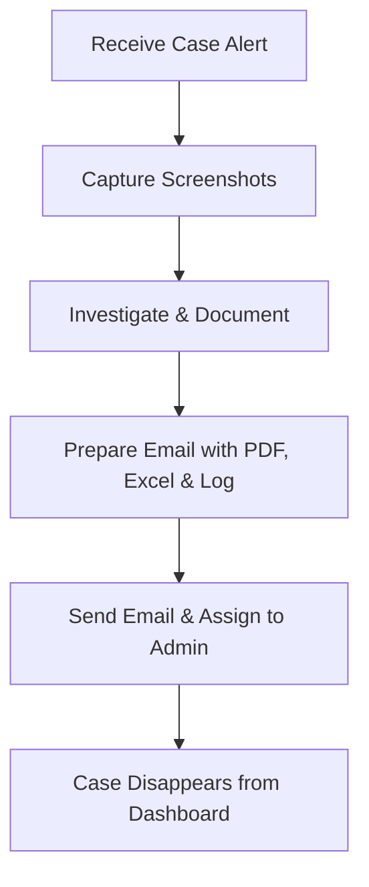

# 🔍 Google Chronicle Training Summary – Feb 13, 2025

Hey everyone! This document is my quick-reference guide for everything we covered in our Google Chronicle training session. I’ve split it into two main sections: **Processos** (the step-by-step processes we need to do) and **Key Points** (the important bits we have to remember). I’ve also added some cool visuals, tables, flow charts, and GIFs to make it fun and easy to follow. Enjoy!

---

## 📑 Table of Contents

- [Processos](#processos)
  - [1. UI Navigation & Time Management](#1-ui-navigation--time-management)
  - [2. Case Handling Process](#2-case-handling-process)
  - [3. EDR & Incident Analysis Process](#3-edr--incident-analysis-process)
  - [4. Log Analysis Process](#4-log-analysis-process)
  - [5. Vulnerability Search Process](#5-vulnerability-search-process)
  - [6. Rule Dashboard Monitoring Process](#6-rule-dashboard-monitoring-process)
  - [7. IOC Dashboard Process](#7-ioc-dashboard-process)
  - [8. Additional Security Tool Monitoring Process](#8-additional-security-tool-monitoring-process)
- [Key Points](#key-points)
  - [1. Google Chronicle Architecture & Comparison](#1-google-chronicle-architecture--comparison)
  - [2. UI & Data Presentation](#2-ui--data-presentation)
  - [3. Log Structure Details](#3-log-structure-details)
  - [4. Search Attributes & UDM Fields](#4-search-attributes--udm-fields)
  - [5. Rules Overview](#5-rules-overview)
  - [6. Dashboard Tools & Their Uses](#6-dashboard-tools--their-uses)
  - [7. Client Network & Security Environment](#7-client-network--security-environment)
  - [8. Additional Security Features](#8-additional-security-features)

---

## Processos

### 1. UI Navigation & Time Management
We learned that the UI in Google Chronicle is designed by Google’s top-notch UI/UX experts. **Always scan the page from top-to-bottom** because the most important details are at the top. Also, don’t forget to check the time zone – if you’re in Sri Lanka, make sure you convert the timeline accordingly. 

### 2. Case Handling Process
Before you assign any case:
- **Take screenshots.**
- **Investigate thoroughly and document your findings.**

When you’re ready, send the case via email with a **PDF report, an Excel sheet, and the raw log file (TXT)**. Only then, assign it to an administrator. Remember: once a case is assigned, it vanishes from your dashboard.

#### Flowchart: Case Handling Process


### 3. EDR & Incident Analysis Process
Start by analyzing the **tactics and techniques** behind an alert. Then, use your research skills to **filter out irrelevant nodes** (like “shadow snapshot”) so you can focus on what really matters.

### 4. Log Analysis Process
Logs are divided into five parts:
- **Metadata:** Includes time stamps and product details.
- **Event:** Contains details like inbound/outbound, IP addresses, etc.
- **Outcome:** Tells you the severity (high, medium, low).
- **Condition:** Explains what triggered the event.
- **Patch:** Shows records of similar events.

Also, note that a single case file can display up to **30 sub-cases**. If there are more, the extra ones will automatically be grouped into another file.

### 5. Vulnerability Search Process
This is how you search for known vulnerabilities:
1. **Search by vulnerability name.**
2. It will list all the rules that cover that vulnerability.
3. You’ll see both **allowed and blocked traffic/events**. Focus on the allowed ones since the blocked ones are already handled.
4. Use filters (like “show only commands”) to zero in on the details you need.

### 6. Rule Dashboard Monitoring Process
Not all rules show up on the main dashboard—especially those with alerting turned off. For this, use the **Rule Dashboard**:
- Check it every **30 minutes**.
- Look at the graphs:
  - A **flat graph** means the rule is triggering consistently (which could be normal or a repeating pattern).
  - A **changing graph** may indicate anomalies.
- Click on a rule to see detailed events and compare with raw logs.

### 7. IOC Dashboard Process
The IOC (or Compromised) Dashboard is our **diamond cave** – it’s a super valuable spot where threat intelligence cases show up. This dashboard filters out already compromised items from threat intel. It’s the perfect place to find cases that need further investigation even if they were previously blocked.

> 
> *This GIF reminds us how threat intel helps us catch phishing alerts.*

### 8. Additional Security Tool Monitoring Process
Our bank uses additional tools for extra protection:
- **IZO:** Monitors the bank’s brand on social media. If someone misuses the bank’s name, we can take action to remove the posts.
- **FortiReason:** Keeps an eye on potential data leaks (like credit card or online banking details) and blocks them immediately.
- **Port Protection:** Always ensure that the network ports are secure.
  
> 
> *This GIF is a fun reminder to always protect our ports!*

---

## Key Points

### 1. Google Chronicle Architecture & Comparison
- **Cloud-Based SIEM:**  
  Google Chronicle is a cloud-based SIEM that replaces older systems by automating processes like log collection, parsing, normalization, categorization, enrichment, storage, and indexed search.
- **Dashboard Differences:**  
  - **Forty Analyzer:** Uses an “Incident Dashboard.”
  - **Chronicle:** Uses a “Case Dashboard.”

### 2. UI & Data Presentation
- The UI is carefully designed so that the **most critical info is always at the top**.
- Always check that the timeline is set to your **local time**.

### 3. Log Structure Details
Logs in Chronicle are divided into:
- **Metadata, Event, Outcome, Condition, and Patch.**
- Be aware that a case file can only show up to **30 sub-cases**—anything extra is moved to a new file.

### 4. Search Attributes & UDM Fields
- Instead of traditional IP addresses, Chronicle uses **"target user"** and **"principal user"** for searches.
- **UDM Fields** are custom fields (like the bank’s web being labeled as **"F5"**) that let you perform advanced searches.

### 5. Rules Overview
- There are two types of rules:
  - **Queue-Related Rules:**  
    Developed by Google’s engineers, these are complex and tend to indicate threats with a high probability (around 75% or more). They need careful investigation.
  - **Custom Rules:**  
    These are simpler and created by us.
- **Alerting Nuances:**  
  Some enabled rules might not trigger alerts if the alerting option is off. Always check these in the Rule Dashboard.

### 6. Dashboard Tools & Their Uses
- **Rule Dashboard:**  
  Shows visual graphs of how often rules are triggered. Helps you spot patterns or anomalies.
- **IOC Dashboard:**  
  Integrates threat intelligence to highlight compromised indicators that might need further action.

### 7. Client Network & Security Environment
- **Network Diagram (Bank Example):**
  - **Topology:**  
    End Users → Switch → **DMZ** → Other segments.
  - **WAF (Web Application Firewall) Placement:**  
    It should be connected inside or coming out of the DMZ.
  
  > 
  > *This GIF shows the WAF server in action.*

- **Perimeter Firewall:**  
  Uses an **implicit cleanup** rule for packets that don’t match any explicit rule.

### 8. Additional Security Features
- **IZO:**  
  Monitors social media for misuse of the bank’s brand.
- **FortiReason:**  
  Detects and blocks data leaks like credit card details or online banking information.

---
## Rights to use

If u want to learn u are welcome, but copying or posting this content is prohibited, Interlectual property belongs to Loard.Mojiii
Let's Learn! 🎉
```
