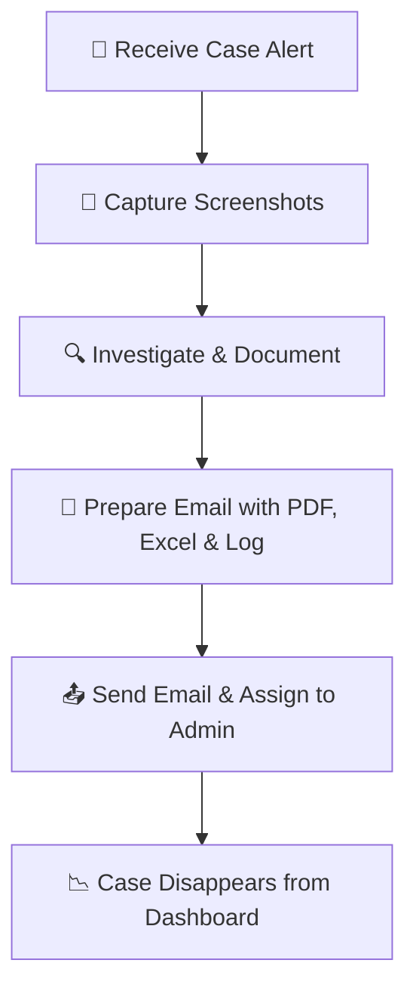

# 🔍 Google Chronicle Training Summary – Feb 13, 2025-Mojii

This document is my quick-reference guide for everything we covered in our Google Chronicle training session. I’ve split it into two main sections: **📌 Processos** (the step-by-step processes we need to do) and **💡 Key Points** (the important bits we have to remember). I’ve also added some cool visuals, tables, flow charts, and GIFs to make it fun and easy to follow. Enjoy! 🎉

---

## 📑 Table of Contents

| 🔢 Section | 📂 Topics Covered |
|------------|------------------|
| **Processos** | UI Navigation, Case Handling, EDR & Incident Analysis, Log Analysis, Vulnerability Search, Rule Dashboard Monitoring, IOC Dashboard, Security Tool Monitoring |
| **Key Points** | Google Chronicle Architecture, UI & Data, Log Structure, Search Attributes, Rules Overview, Dashboard Tools, Security Environment, Additional Features |

---

## 🛠 Processos

### 1️⃣ UI Navigation & ⏳ Time Management
We learned that the UI in Google Chronicle is designed by Google’s top-notch UI/UX experts. **🧐 Always scan the page from top-to-bottom** because the most important details are at the top. Also, don’t forget to check the ⏰ time zone – if you’re in 🇱🇰 Sri Lanka, make sure you convert the timeline accordingly.

### 2️⃣ Case Handling Process 📝
Before you assign any case:
✅ **Take screenshots.**
✅ **Investigate thoroughly and document your findings.**
✅ **Send a PDF report, an Excel sheet, and the raw log file (TXT).**
✅ **Only then, assign it to an administrator.**

#### 🛠 Flowchart: Case Handling Process

### 3️⃣ EDR & Incident Analysis Process 🛡
Start by analyzing the **tactics and techniques** behind an alert. Then, use your research skills to **filter out irrelevant nodes** (like “shadow snapshot”) so you can focus on what really matters.

📊 **Incident Analysis Breakdown:**
| ⚡ Alert Type | 🔍 Investigation Step | 🛡 Action Needed |
|-------------|--------------------|-----------------|
| Phishing 🦠 | Check email headers, IPs | Report & Block 🚫 |
| Malware 🦠 | Analyze hash, endpoints | Quarantine & Patch 🔧 |
| Unauthorized Access 🚨 | Verify logs & users | Revoke Access 🔐 |

### 4️⃣ Log Analysis Process 📜
Logs are divided into five parts:
- **🕒 Metadata:** Includes timestamps and product details.
- **📢 Event:** Contains details like inbound/outbound, IP addresses, etc.
- **⚠️ Outcome:** Tells you the severity (high, medium, low).
- **📌 Condition:** Explains what triggered the event.
- **📋 Patch:** Shows records of similar events.

### 5️⃣ Vulnerability Search Process 🛠
🔍 **How to search for known vulnerabilities:**
1️⃣ **Search by vulnerability name.**
2️⃣ Check **all rules that cover that vulnerability.**
3️⃣ **Focus on allowed traffic**, as blocked traffic is already handled.
4️⃣ Use filters like **“show only commands”** to zero in on details.

### 📈 Rule Dashboard Monitoring Process 📊
Not all rules show up on the main dashboard—especially those with alerting turned off.
✅ Check it every **30 minutes**.
✅ Look at the **graphs**:
   - 📉 **Flat graph:** Normal, repeating pattern.
   - 📈 **Changing graph:** Possible anomalies.

---

## 🔑 Key Points

### 1️⃣ Google Chronicle Architecture 🏛 & Comparison ⚖️
| Feature 🔍 | Chronicle 🏆 | Traditional SIEM 🏚 |
|-----------|-------------|-----------------|
| **Cloud-Based** ☁️ | ✅ Yes | ❌ No |
| **Automation** 🤖 | ✅ Fully Automated | ❌ Manual Parsing |
| **Threat Intelligence** 🛡 | ✅ Built-in | ❌ Requires Add-ons |

### 2️⃣ UI & Data Presentation 🎨
🎯 **Always check that the timeline is set to your local time**.
🔍 The UI places **critical info at the top** for quick reference.

### 3️⃣ Log Structure Details 📜
📝 Logs in Chronicle are divided into:
✅ **Metadata**
✅ **Event Details**
✅ **Outcome Assessment**
✅ **Trigger Condition**
✅ **Patch Records**

### 4️⃣ Search Attributes & UDM Fields 🔎
- Instead of **IP addresses**, Chronicle uses **“target user”** and **“principal user”**.
- **UDM Fields** allow **advanced searches** based on labeled fields.

### 5️⃣ Rules Overview 📜
| Rule Type ⚖️ | Owner 🏆 | Investigation Needed 🕵️ |
|-------------|------------|-----------------|
| **Queue-Related Rules** | Google Engineers 👨‍💻 | High Probability Threats 🔥 |
| **Custom Rules** | Created by Us ✍️ | Simpler Analysis 🔍 |

### 6️⃣ Dashboard Tools & Their Uses 📊
✅ **Rule Dashboard:** Shows visual graphs of rule triggers.
✅ **IOC Dashboard:** Integrates threat intelligence indicators.

### 7️⃣ Client Network & Security Environment 🔐
📡 **Network Diagram:**
📌 End Users → Switch → **DMZ** → Other Segments
🔗 **WAF Placement:** Connected inside or after DMZ.

### 8️⃣ Additional Security Features 🚀
✅ **IZO:** Monitors social media for bank brand misuse.
✅ **FortiReason:** Detects and blocks data leaks like credit card fraud.

---
## 🚀 Rights to Use

📌 If you want to **learn**, you’re welcome! But **copying or reposting** is **strictly prohibited**. Intellectual property belongs to **Lord.Mojiii** ⚖️.

Let’s keep learning! 🎉
